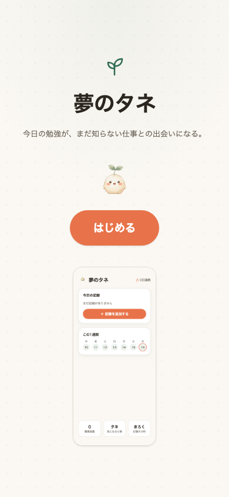

# 夢のタネ

**[デモを見る](https://web-soma2028.vercel.app)**
（Renderの無料枠を使っているため、しばらくアクセスが無いとスリープします。
初回アクセスは起動に50秒ほどかかることがあります）

<p>
  
  
  
  
</p>

## 何を作ったか

将来の夢がまだ無い中学生向けの、**学習記録 × 職業図鑑**のWebアプリ。
今日勉強した教科を記録すると、その教科をよく使う職業が1件見つかり、職業図鑑に
少しずつ登録されていく。「あなたに合う職業」を当てることを目的にしていない。
**知らなかった職業にどれだけ出会えたか**を評価軸に置いている。

## なぜ作ったか

中学生のとき、将来の夢がありませんでした。高校は、
行事が楽しそうだという理由で選びました。将来やりたいことと
結びつけて選んだわけではありません。

データサイエンスという分野があることを知ったのは、
大学のオープンキャンパスです。それまで、この分野の存在自体を
知りませんでした。知らなかったのだから、選択肢に入るはずも
ありませんでした。

塾講師として中学生を教えるようになって、同じ状態の子に
何人も会いました。「将来の夢は?」と聞かれて答えられない子は、
夢を持つ気がないのではありません。知っている職業が数十個しか
ないだけです。その中に自分に合うものがなければ、答えようがない。

このアプリは、夢を決めさせるためのものではありません。
まだ知らない職業に出会う回数を増やすためのものです。

## 技術的な見どころ

1. **job tag（厚労省）167職業のデータ整備と前処理**
   RIASEC（職業興味）データが利用可能な518職業のうち36職業で欠損があった。
   欠損はランダムではなく、ドローンパイロット・データエンジニアなど比較的新しい
   職業に偏っているという構造的な偏りを発見し、知識・仕事の性質のスコアから
   Ridge回帰で補完する方針に転換した。`riasec_source`（実測／推定／推定不能）の
   3値管理で対処し、検証の過程で入力が全欠損の7件が同一の予測値になるバグを
   発見・修正した

2. **学習記録と職業の知識項目の対応設計**
   job tagの「知識」33項目のうち17項目を、数学・国語・理科・社会・英語・美術・
   音楽・技術/家庭の8教科に対応づけた。美術と音楽はjob tag側では「芸術」1項目分
   のスコアしか無いため、同じ候補プールを共有する。保健体育は対応する知識項目が
   構造的にゼロで、埋める手段も無い。「選択肢から外す」のではなく「記録はできるが
   職業発見の対象外」という扱いにし、APIのレスポンスに`is_special`フラグを
   持たせて表現した

3. **認知度ラベルの設計**
   「子どもの職業認知度」を測った公開データは存在しない。Wikipediaの記事有無・
   ページビューを代理指標として検証したが機能せず、認知度モデルを全職業へ拡張する
   案、RIASEC欠損職業を一律除外する案もそれぞれ検証の上で棄却した。最終的に
   556職業を職業分類で層化抽出した179職業に、1名による実測ラベル（知っている／
   聞いたことがある／知らない）を付与する方式に切り替えた。179件のうち167件が
   RIASECも利用可能で、推薦対象として使っている。3つの案を棄却した経緯は
   [docs/design.md](docs/design.md)に記録している

4. **3形式の転換の記録**
   10問クイズ形式 → スワイプ形式 → 学習記録＋職業図鑑、という3段階の構造転換を
   経ている。いずれも設計・実装・検証まで行った上で次に移行しており、何を試し
   何が機能しなかったかという判断の過程は[docs/design.md](docs/design.md)・
   [docs/questions.md](docs/questions.md)に記録している

その他の設計判断（相関を因果に見せない文言設計、`localStorage`のみで状態を持つ
構成など）も[docs/design.md](docs/design.md)にまとめている。

## 未実施の検証

想定ユーザーである中学生本人によるユーザビリティ検証は未実施。「勉強を記録する」
行為が続けたくなるものか、見つかった職業と教科の繋がりが正しく伝わるか
（因果に読み違えられていないか）、抽選の重み3:2:1に納得感があるかなど、
未確認の点は[docs/design.md](docs/design.md)に記録している。

## データ出典

独立行政法人労働政策研究・研修機構（JILPT）作成
職業情報データベース
簡易版数値系ダウンロードデータ ver.7.00 /
解説系ダウンロードデータ ver.7.01
職業情報提供サイト（job tag）より取得
https://shigoto.mhlw.go.jp/User/download

著作権はJILPTが保有。利用規約に基づき、出典明記のうえ二次利用している。
取得日・ファイル構成など詳細は[data/README.md](data/README.md)を参照。

## 構成

web/（Vercel） api/（Render） data/ notebooks/ docs/

## ローカルで動かす

### API

```bash
cd api
source .venv/bin/activate
pip install -r requirements-dev.txt  # 初回のみ（notebooks実行やテストも含むフル環境）
uvicorn app.main:app --reload
```

`http://127.0.0.1:8000` で起動する。`data/processed/jobs.csv`（Git管理対象）
だけで動くため、これだけならjob tagの生CSVは不要。notebooksを実行して
データを作り直す場合のみ、job tagの生CSVを`data/raw/`に手動配置する必要が
ある（取得元・手順は[data/README.md](data/README.md)参照）。

### フロント

```bash
cd web
npm install
npm run dev
```

`http://localhost:5173` で起動する。ローカルでは環境変数を設定しなくても
`http://127.0.0.1:8000` のAPIに接続する（`web/.env.example`参照）。

## デプロイ

### API → Render

- Root Directory: `api`
- Build Command: `pip install -r requirements.txt`（本番用の最小依存関係。
  notebooks用の`requirements-dev.txt`とは別）
- Start Command: `uvicorn app.main:app --host 0.0.0.0 --port $PORT`
- 環境変数:
  - `ALLOWED_ORIGINS` — フロントのオリジンをカンマ区切りで指定
    （例: `https://yumetane.vercel.app`）。ローカル開発用の
    `http://localhost:5173` は常に許可されるため設定不要
- Renderの無料枠はアイドル時にスリープし、初回アクセスに数十秒かかることが
  ある。フロント側がトップ画面表示時にウォームアップ用のリクエストを
  送るようになっている（`web/src/api.ts`の`warmupApi`、結果は使わず
  失敗しても画面表示には影響しない）

### フロント → Vercel

- Root Directory: `web`
- Framework Preset: Vite（自動検出）
- Build Command: `npm run build`
- Output Directory: `dist`
- 環境変数:
  - `VITE_API_BASE_URL` — RenderにデプロイしたAPIのURL
    （例: `https://yumetane-api.onrender.com`）
