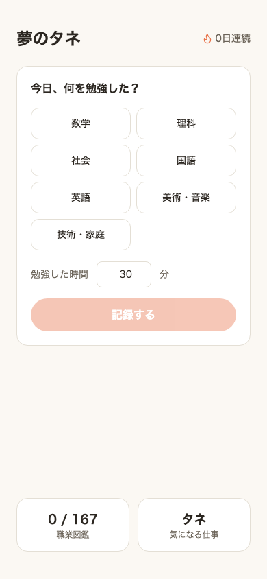
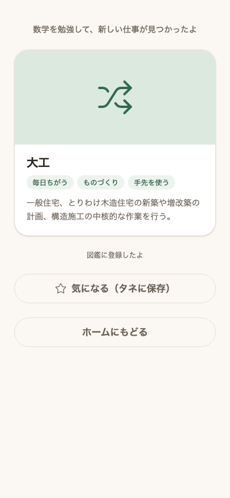
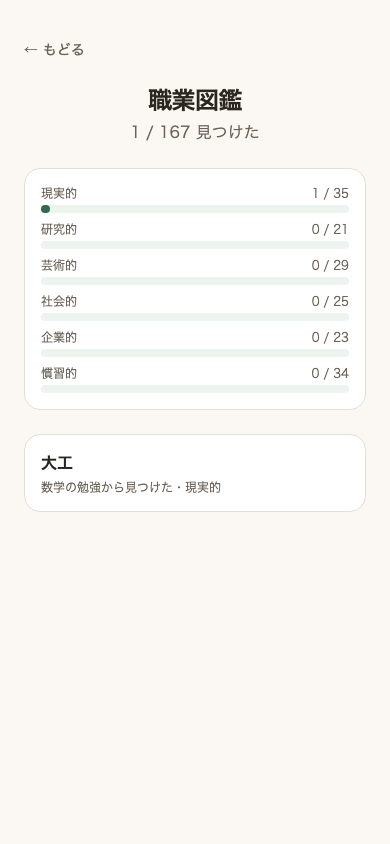

# 夢のタネ

**[デモを見る](https://web-soma2028.vercel.app)**
（Renderの無料枠を使っているため、しばらくアクセスが無いとスリープします。
初回アクセスは起動に50秒ほどかかることがあります）

サービスの説明・課題設定・仕組みは、アプリ自身のランディングページが担っています。
このREADMEでは技術的な内容にとどめます。

<p>
  
  
  
</p>

## 何を作ったか

将来の夢がまだ無い中学生向けに、今日勉強した教科を記録すると、その教科を
よく使う職業が1件見つかり、職業図鑑に少しずつ蓄積されていくWebアプリ。
「あなたに合う職業」を当てることを目的にしていない。**知らなかった職業に
どれだけ出会えたか**を評価軸に置いている。

## なぜ作ったか

中学生のとき、将来の夢がありませんでした。高校は、行事が楽しそうだという
理由で選びました。将来やりたいことと結びつけて選んだわけではありません。

データサイエンスという分野があることを知ったのは、大学のオープンキャンパス
です。それまで、この分野の存在自体を知りませんでした。知らなかったのだから、
選択肢に入るはずもありませんでした。

塾講師として中学生を教えるようになって、同じ状態の子に何人も会いました。
「将来の夢は？」と聞かれて答えられない子は、夢を持つ気がないのではありません。
知っている職業が数十個しかないだけです。その中に自分に合うものがなければ、
答えようがない。

このアプリは、夢を決めさせるためのものではありません。まだ知らない職業に
出会う回数を増やすためのものです。だから推薦の精度ではなく、「知らなかった
職業に出会えたか」を評価の軸に置いています。

## 技術的な見どころ

- **教科ごとの職業発見**: job tagの33知識項目のうち17項目を7教科（数学・理科・
  社会・国語・英語・美術/音楽・技術/家庭）に対応づけ、該当教科の知識スコア
  上位30件からまだ図鑑に無い職業を、認知度に応じた重み（3:2:1、暫定値）で
  抽選する。保健体育は対応する知識項目が構造的にゼロで、選択肢からも除外した
  （判断の記録は[docs/design.md](docs/design.md)）
- **相関を因果に見せない設計**: 「この職業は数学をよく使う」という関連スコアを
  「数学を勉強すればこの職業に近づく」という因果の主張にすり替えないよう、
  UI文言・ランディングページの両方で明記している
- job tag（日本版O-NET、独立行政法人労働政策研究・研修機構が公開する職業情報
  データベース）を加工し、RIASEC（職業興味）データが欠損する36職業を知識・
  仕事の性質からRidge回帰で補完。`riasec_source`（実測／推定／推定不能）の
  3値管理で対処し、入力が全欠損の7件が同一の予測値になるバグを検証で発見して
  修正した
- 「子どもの職業認知度」を測った公開データは存在しないため、Wikipediaの
  記事有無・ページビューを代理指標として検証したが機能せず、最終的に
  1名による自作ラベル（層化抽出した179職業、未検証である旨を明記）に
  切り替えた
- **10問クイズ形式 → スワイプ形式 → 学習記録＋職業図鑑**、という3段階の
  構造転換を経ている。いずれも設計・実装・検証まで行った上で次に移行して
  おり、何を試し何が機能しなかったかという判断の過程は
  [docs/design.md](docs/design.md)・[docs/questions.md](docs/questions.md)
  に記録している
- 状態はブラウザの`localStorage`のみに保存（ログイン無し、個人情報を取得
  しない設計。端末を変えると記録は消える前提）

## 未実施の検証

想定ユーザーである中学生本人によるユーザビリティ検証は未実施。「勉強を記録する」
行為が続けたくなるものか、見つかった職業と教科の繋がりが正しく伝わるか
（因果に読み違えられていないか）、抽選の重み3:2:1に納得感があるかなど、
未確認の点は[docs/design.md](docs/design.md)に記録している。

## データ出典

`data/README.md` 参照

## 構成

web/（Vercel） api/（Render） data/ notebooks/ docs/

## ローカルで動かす

### API

```bash
cd api
source .venv/bin/activate
pip install -r requirements-dev.txt  # 初回のみ（notebooks実行やテストも含むフル環境）
uvicorn app.main:app --reload
```

`http://127.0.0.1:8000` で起動する。

### フロント

```bash
cd web
npm install
npm run dev
```

`http://localhost:5173` で起動する。ローカルでは環境変数を設定しなくても
`http://127.0.0.1:8000` のAPIに接続する（`web/.env.example`参照）。

## デプロイ

### API → Render

- Root Directory: `api`
- Build Command: `pip install -r requirements.txt`（本番用の最小依存関係。
  notebooks用の`requirements-dev.txt`とは別）
- Start Command: `uvicorn app.main:app --host 0.0.0.0 --port $PORT`
- 環境変数:
  - `ALLOWED_ORIGINS` — フロントのオリジンをカンマ区切りで指定
    （例: `https://yumetane.vercel.app`）。ローカル開発用の
    `http://localhost:5173` は常に許可されるため設定不要
- Renderの無料枠はアイドル時にスリープし、初回アクセスに数十秒かかることが
  ある。フロント側がトップ画面表示時にウォームアップ用のリクエストを
  送るようになっている（`web/src/api.ts`の`warmupApi`、結果は使わず
  失敗しても画面表示には影響しない）

### フロント → Vercel

- Root Directory: `web`
- Framework Preset: Vite（自動検出）
- Build Command: `npm run build`
- Output Directory: `dist`
- 環境変数:
  - `VITE_API_BASE_URL` — RenderにデプロイしたAPIのURL
    （例: `https://yumetane-api.onrender.com`）
