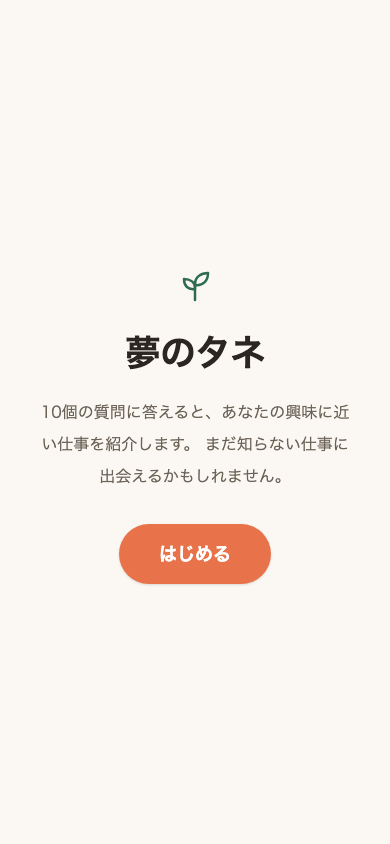
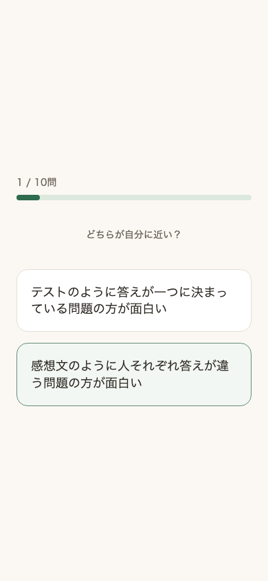
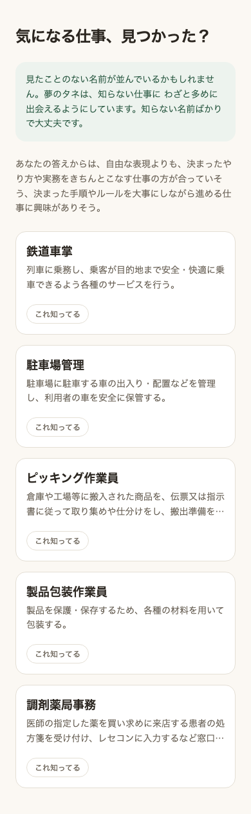

# 夢のタネ

**[デモを見る](https://web-five-chi-83.vercel.app)**
（Renderの無料枠を使っているため、しばらくアクセスが無いとスリープします。
初回アクセスは起動に50秒ほどかかることがあります）

<p>
  
  
  
</p>

## 何を作ったか

将来の夢がまだ無い中学生向けに、10個の質問に答えるとその子の興味に近い職業を
紹介するWebアプリ。ただし「あなたに合う職業」を当てることを目的にしていない。
**知らなかった職業にどれだけ出会えたか**を推薦の評価軸に置いている。

## なぜ作ったか

中学生は将来の夢を「持っていない」割合が最も高く（22.0%）、学年が上がるほど
その割合は下がる（中1: 60.7% → 中3: 46.3%）。「夢が無い」ことの一因は、
本人に合う職業をそもそも知らないという認知の制約だと考え、推薦精度ではなく
「知らない職業との出会い（セレンディピティ）」を主指標に据えた。

## 技術的な見どころ

- job tag（日本版O-NET、独立行政法人労働政策研究・研修機構が公開する職業情報
  データベース）を加工し、職業興味（RIASEC）・仕事内容などの数値データから
  推薦用の特徴量を構築
- RIASECデータを持つ518職業中36件で欠損があり、知識・仕事の性質からRidge回帰
  で補完しようとしたところ、入力が全欠損の7件が同一の予測値になるバグを
  検証で発見し、`riasec_source`（実測／推定／推定不能）の3値管理で対処
- 「子どもの職業認知度」を測った公開データは存在しないため、Wikipediaの
  記事有無・ページビューを代理指標として検証したが機能せず、最終的に
  1名による自作ラベル（層化抽出した179職業）に切り替えた
- RIASEC 6因子の相関構造をPCAで分析し、直交する主成分ベースで質問を設計
  （10問で6次元空間に配置）。確定後の自己検証で選択肢の並び順による
  反応バイアスを検出し、表示順のランダム化を実装
- データ整備・モデル構築の過程で3つの案（Wikipedia記事有無を知名度指標に
  採用する案／認知度ラベルをモデルで全職業に拡張する案／RIASEC欠損を
  一律除外する案）を検証の上で棄却している。何を試し、何が機能せず、
  なぜ次の案に移ったかという判断の過程は[docs/design.md](docs/design.md)
  に記録している

## 未実施の検証

想定ユーザーである中学生本人によるユーザビリティ検証（質問文が伝わるか、
10問を最後まで答えられるか、結果に出た「知らない職業」に納得感があるか）は
未実施。

## データ出典

`data/README.md` 参照

## 構成

web/（Vercel） api/（Render） data/ notebooks/ docs/

## ローカルで動かす

### API

```bash
cd api
source .venv/bin/activate
pip install -r requirements-dev.txt  # 初回のみ（notebooks実行やテストも含むフル環境）
uvicorn app.main:app --reload
```

`http://127.0.0.1:8000` で起動する。

### フロント

```bash
cd web
npm install
npm run dev
```

`http://localhost:5173` で起動する。ローカルでは環境変数を設定しなくても
`http://127.0.0.1:8000` のAPIに接続する（`web/.env.example`参照）。

## デプロイ

### API → Render

- Root Directory: `api`
- Build Command: `pip install -r requirements.txt`（本番用の最小依存関係。
  notebooks用の`requirements-dev.txt`とは別）
- Start Command: `uvicorn app.main:app --host 0.0.0.0 --port $PORT`
- 環境変数:
  - `ALLOWED_ORIGINS` — フロントのオリジンをカンマ区切りで指定
    （例: `https://yumetane.vercel.app`）。ローカル開発用の
    `http://localhost:5173` は常に許可されるため設定不要
- Renderの無料枠はアイドル時にスリープし、初回アクセスに数十秒かかることが
  ある。フロント側がトップ画面表示時にウォームアップ用のリクエストを
  送るようになっている（`web/src/api.ts`の`warmupApi`、結果は使わず
  失敗しても画面表示には影響しない）

### フロント → Vercel

- Root Directory: `web`
- Framework Preset: Vite（自動検出）
- Build Command: `npm run build`
- Output Directory: `dist`
- 環境変数:
  - `VITE_API_BASE_URL` — RenderにデプロイしたAPIのURL
    （例: `https://yumetane-api.onrender.com`）
